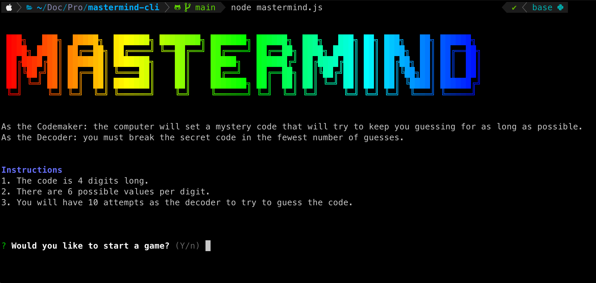

# Mastermind Game

The classic [mastermind](https://en.wikipedia.org/wiki/Mastermind_%28board_game%29) game in command line form running on Node.



# Setup Instructions

```
git clone git@github.com:xprmnts/mastermind-cli.git
cd mastermind-cli
npm install
node mastermind.js
```

# Game Instructions

As the Code-maker: the computer will set a mystery code that will try to keep you guessing for as long as possible.
As the Decoder: you must break the secret code in the fewest number of guesses.

### Gameplay Instructions

1. The code is 4 digits long. Enter a contiguous sequence of digits.
2. There are 6 possible values per digit. Each digit must be between 1-6 (inclusive).
3. You will have 10 attempts as the decoder to try to guess the code.

# Features

1. Configurable Code Length - Coming Soon
2. Configurable Number of Choices per Peg - Coming Soon
3. Configure repeats - Coming Soon
4. Configure Allowed Attempts - Coming Soon
5. Configure Allowed Time - Coming Soon
